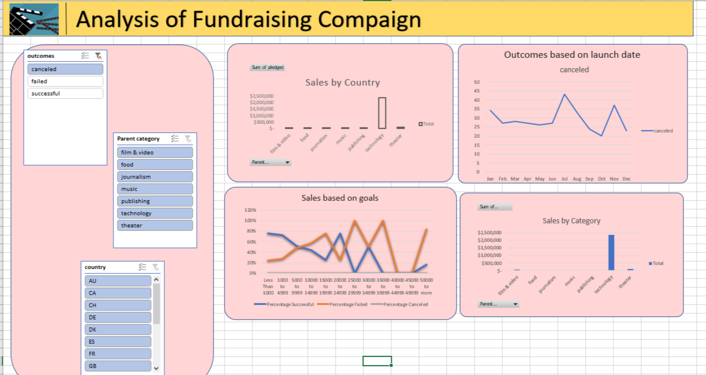
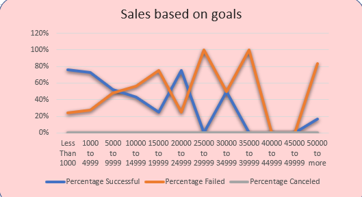
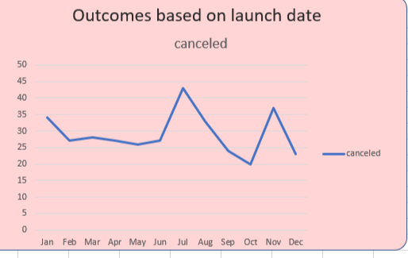
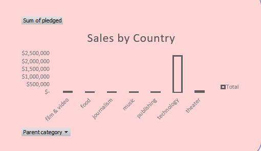
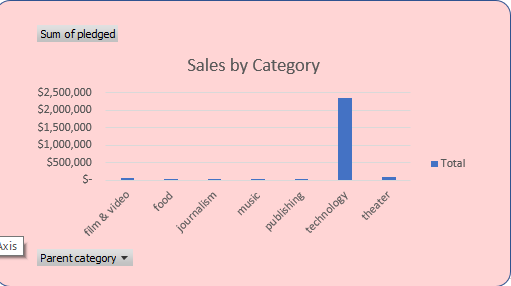

# Fundraising-Analysis
## Overview of Project

I made an interactive dashboard to see what the funds in a fundraising campaign were
Below is all analysis I made

[project document](Kickstarter_Challenge.xlsx)
Go to file
t
Latest commit
abdirahmanM
abdirahmanM
Add files via upload)
### Purpose
see what the funds are and how it works
## Analysis and Challenges
In this project I used shapes and pivot tables to determine outcome

### Analysis of Outcomes Based on Launch Date

### Analysis of Outcomes Based on Goals

### Challenges and Difficulties Encountered
It was hard getting the correct pivot table set right
## Results
The results of this project was a dashboard that contained information that used to see funds raised by a fundraising campaign and even though it was hard to create it in the beginging I now know how to do it and I can make a better one in the future.
- What are two conclusions you can draw about the Outcomes based on Launch Date?
they come together well and it shows how the graph works and the money flow
- What can you conclude about the Outcomes based on Goals?
they come togther well and how the graphs works and the money flow
- What are some limitations of this dataset?
The map aspect of it and how you can't add it to make it more detailed
- What are some other possible tables and/or graphs that we could create?
 Below is the examples of the possible graphs you can create. the first graph shows the sales by country and the second graph shows the sales by category

 
